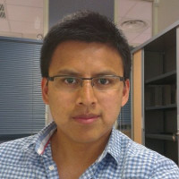

# romarcg.github.io

>[Current research](#currentresearch)  
>[Previous research](#previousresearch)  
>[Curriculum vitae](#cv)  
>[Contact information](#contact)  
>[Publications](#publications)  

> [LI][linkedin] [RG][rg]

[linkedin]: https://fr.linkedin.com/in/ricardo-omar-chavez-garcia-029b5734 "My profile in LinkedIn"
[rg]: https://www.researchgate.net/profile/Ricardo_Chavez-Garcia "My profile in ResearchGate"

I am a researcher working on multi-sensor stochastic methods for robotic semantic perception. My current work focus on learning sensorimotor representations for scene understanding through the interaction of perception and action processes. I am interested on proposing and developing intelligent systems and robotic platforms that interact with the real world.

##  Current research

We study and develop sensori­motor representations that fuse perceptual data (scene and parts of the agent), proprioceptive feedback (agent’s own configuration), contextual information (previous knowledge) and the agent’s goals. We shall develop theories about the importance and influence of each input and their fusion for understanding the scene.

We also assume that scene interpretation is necessarily related to learning new objects or adding knowledge about known  objects. Hence we shall also study the relationship between interpretation and learning.
The learning process will consist in building sensorimotor representations of both scene elements and associated actions.

[RoboErgoSum - Self Aware Robots](http://roboergosum.isir.upmc.fr/), is a four year project funded by the French National Research Agency ANR which objective is to explore artificial conscienceness in robotics.

[The Institute for Intelligent Systems and Robotics (ISIR)](http://www.isir.upmc.fr/)  
[University Pierre et Marie Curie](http://www.upmc.fr/en/)  
[The National Center for Scientific Research](http://www.cnrs.fr/)

[&uarr;](#toppage)

##  Previous research

I worked on probabilistic and credibilist methods to fuse information from an heterogeneous array of sensors.
Three modules were proposed and implemented to work simultaneously in a and Advance Driver Assistant System: multi-target object dectection, classification and tracking of multiple objects in dynamic scenarios.

### Responsible of the Perception sub-project - interactIVe (accident avoidance by active intervention for Intelligent Vehicles) IP European Project

Proposal and development of a multi-sensor fusion solution software for a frontal object perception application. It involved: outdoor environment mapping; detection, tracking and classification of multiple objects of interest in different driving scenarios. Multiple sensor (lidar, camera and radar) fusion was at the core of the perception task.
The solution was part of a whole automotive application involving several car manufacturers and suppliers inside the [interactIVe European project](http://www.interactive-ip.eu/).

*Related videos:*

<iframe id="ytplayer" type="text/html" width="320" height="270" src="http://www.youtube.com/embed/tRdZBzfSMzk?autoplay=0&origin=http://www.romarcg.xyz"  frameborder="0"> </iframe>

<iframe id="ytplayer" type="text/html" width="320" height="270" src="http://www.youtube.com/embed/UZdwP-Z9mkA?autoplay=0&origin=http://www.romarcg.xyz"  frameborder="0"> </iframe>

[Grenoble Informatics Laboratory](https://www.liglab.fr/en)  
[Université Grenoble Alpes](http://www.univ-grenoble-alpes.fr/)

[&uarr;](#toppage)
##  Curriculum vitae

A pdf version is found [here](/docs/cv.pdf)

[&uarr;](#toppage)
##  Contact

[//]: <> (>*Institut des Systèmes Intelligents et de Robotique (ISIR)*  )

[//]: <> (>*Université Pierre et Marie CURIE*  )

[//]: <> (> *Pyramide - T55/65*  )

[//]: <> (> *CC 173 - 4 Place Jussieu*  )

[//]: <> (> *75005 Paris*  )

[//]: <> (> chavez <i class="icon-at"></i> isir <i class="icon-point"></i> upmc <i class="icon-point"></i> fr  )

>*Dalle Molle Institute for Artificial Intelligence Research (IDSIA)*  
>*University of Applied Sciences and Arts of Southern Switzerland (SUPSI) *
>*Università della Svizzera italiana*  
> *Galleria 2, Via Cantonale 2c*  
> *CH-6928 Manno*  
> *Switzerland*  
> omar <i class="icon-at"></i> idsia <i class="icon-point"></i> ch  
[//]: <> (>*Scuola Universitaria Professionale della Svizzera Italiana *)

[&uarr;](#toppage)
